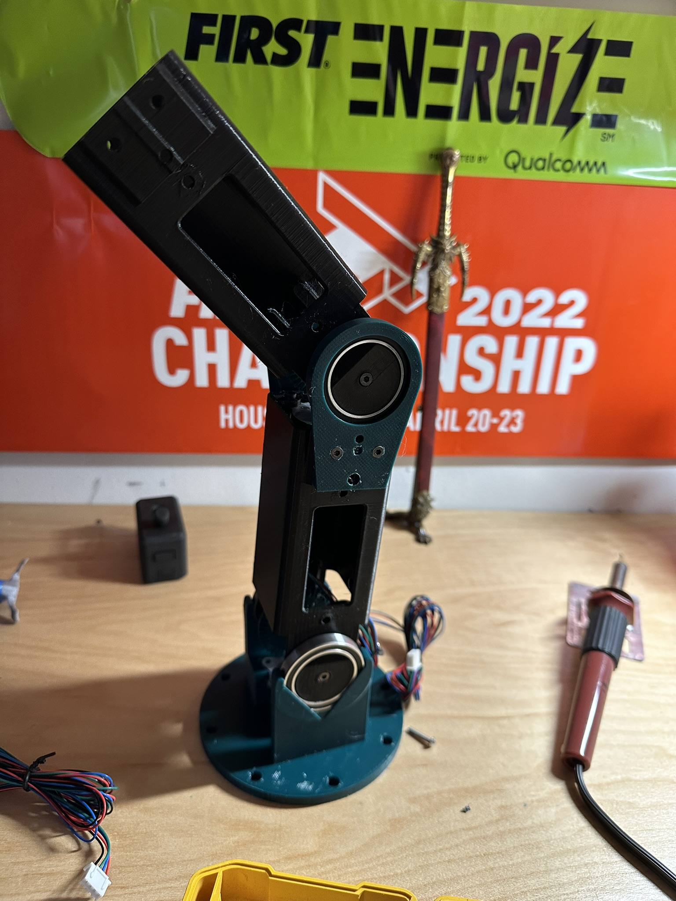

# RARM-mk1

## WebIoPi app and python logic with IKE for controlling the RARM 

The 3D-Printed robotic arm is actuated by six stepper motors and controlled from a computer. The **PI** is running a **WebIoPi** server which schedules python scripts on the **PI**. The scripts calculate inverse kinematics and use **TMC2208** stepper drivers to drive [**FYSETC**](https://www.amazon.com/FYSETC-Printer-Extruder-47-2inch-Accessories/dp/B099JMJNH2/ref=sr_1_18) stepper motors. A [**Seeeduino XIAO**](https://wiki.seeedstudio.com/Seeeduino-XIAO/) connected to the **PI** reads analog inputs from potentiometers on the joints and relays the information.

##### [GitHub](https://github.com/aCoder1123/RARM-mk1)